<!-- ════════════════════════ HERO ════════════════════════ -->

  

  
  

## 🧑‍💻 whoami

  

- 🎓 **MSc in Data Science** @ **Nanyang Technological University, Singapore** - College of Computing & Data Science *(Aug 2026)*
- 💼 3 years shipping **credit-risk ML end-to-end** - Lead ML Engineer @ MyShubhLife, Analyst - ML Processes @ UGRO Capital
- 🔬 Into **GNNs**, **time-series**, **model interpretability**, **efficient ML**, and **audio** - with a soft spot for Kaggle leaderboards 🎹

## 🚀 The Journey

  

## 📊 Production Impact

  

## 🛠️ Tech Stack

**Languages & Core**

**ML / Deep Learning**

**MLOps & Infrastructure**

## 🏆 Kaggle Highlights

| Competition | What I built |
|---|---|
| 🏈 **[NFL Big Data Bowl 2026](https://github.com/ShreyanshGoyal/nfl_big_data_bowl_2026)** - *Player Trajectory Modeling* | Spatio-temporal residual model over a physics baseline (CatBoost + LightGBM + neural head with horizon buckets) on `[batch, steps, players, features]` tensors - **~0.65 RMSE** locally vs. a ~0.70 leaderboard baseline, with a leakage-safe training/eval pipeline. |
| 🧩 **[NeuroGolf 2026](https://github.com/ShreyanshGoyal/neurogolf_2026)** - *Minimal Neural Networks for ARC-AGI* | Rule-detection + per-task training pipeline producing the **smallest possible ONNX networks** that *exactly* solve abstract-reasoning grid tasks under strict parameter budgets, via automated architecture shrinking and verification. |

## 💡 Featured Projects

| Project | What it does |
|---|---|
| 🎙️ **[Query by Humming](https://github.com/ShreyanshGoyal/query_by_humming)** | MFCC + DTW retrieval for humming-to-song search, robust to tempo drift, with alignment visualizations and ranking diagnostics. |
| 🧠 **[RNN Repair Reproduction](https://github.com/ShreyanshGoyal/rnnrepair-reproduction)** | Reproduction and extension of *RNNRepair* (Xie et al., ICML 2021) - course project (IE643, IIT Bombay). Our additions: confidence-score thresholding, K-means vs. Mean-shift vs. GMM state abstraction, and extending sample-level influence analysis to CNNs. |
| 🌗 **[Ray Tracing Engine](https://github.com/ShreyanshGoyal/ray_tracing_engine)** | From-scratch renderer with a result gallery and benchmarks. |
| 🌀 **[Multi-Objective Optimization](https://github.com/ShreyanshGoyal/multi_objective_optimization)** | Python scaffolding for Pareto-front experiments. |
| 🧩 **[Connectionist Model](https://github.com/ShreyanshGoyal/connectionist_model)** | Experiments toward global-workspace-style signals. |

## 🤝 Let's Connect

  
  
  

<!-- ════════════════════════ FOOTER ════════════════════════ -->

  

